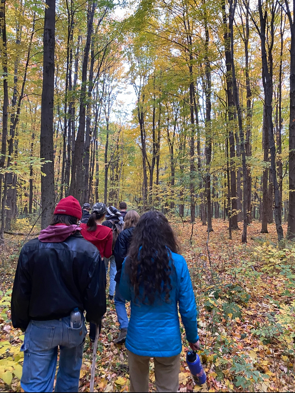
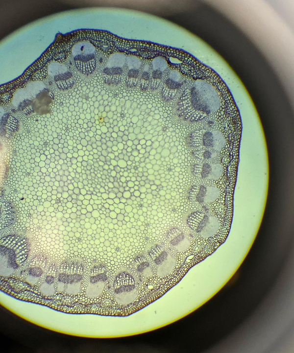
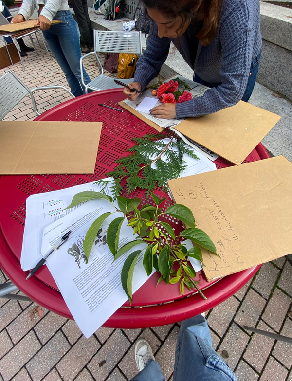
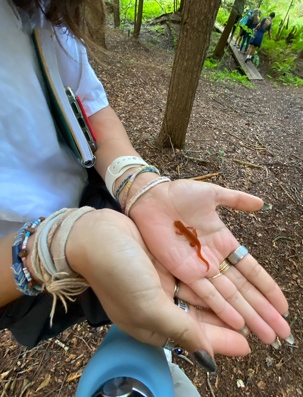
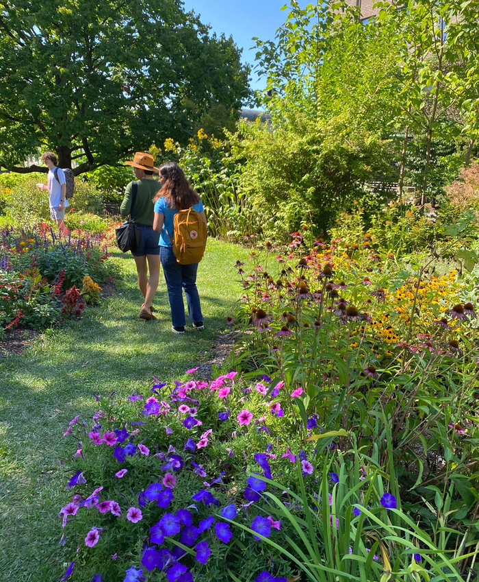

<style>
#imageCarousel {
  max-width: 500px;
  height: 500px;
  margin: 30px auto;
}

#imageCarousel .carousel-inner,
#imageCarousel .carousel-item {
  height: 100%;
}

#imageCarousel .carousel-item img {
  height: 100%;
  width: 100%;
  object-fit: cover;  /* This is the key - crops nicely */
}
</style>

### A little bit of background!

  I grew up in rural Texas hill country, loving the outdoors and spending sunrise to sunset either hiking or paddle boarding on the river near my house. My passion for the environment expanded throughout high school as I was able to work at a plant nursery during the summers and on weekends, learning the scientific names of many native Texas plants and how to care for each one. 

  As a first-generation college student, my world expanded immensely when I got the opportunity to attend Cornell University for Plant Science. I explored many areas of the subject, from evolution to landscape architecture. I eventually narrowed down to concentrating in computational biology, and later discovered that I am most passionate about using data to better understand our environment, whether that be using statistics to predict the changes in flowering time due to climate change or mapping species diversity. To complement my plant science education, I branched out and took many classes in the computer science, information science, and math departments to learn how I could apply these concepts to plants and the environment. I completed a minor in data science and worked on various projects integrating data and the environment, including a few years of bioinformatics research on the phylogenetics of non-model plant species!
  
### Plant Science Gallery
```{=html}
<div id="imageCarousel" class="carousel slide" data-bs-wrap="false">
  <div class="carousel-inner">
    
    <!-- Image 1 -->
    <div class="carousel-item active">
      
    </div>
    
    <!-- Image 2 -->
    <div class="carousel-item">
      
    </div>
    
    <!-- Image 3 -->
    <div class="carousel-item">
      
    </div>

    <!-- Image 4 -->
    <div class="carousel-item">
      
    </div>    
    
    <!-- Image 5 -->
    <div class="carousel-item">
      
    </div>
    
  </div>
  
  <!-- Left arrow (Previous) -->
  <button class="carousel-control-prev" type="button" data-bs-target="#imageCarousel" data-bs-slide="prev">
    <span class="carousel-control-prev-icon" aria-hidden="true"></span>
    <span class="visually-hidden">Previous</span>
  </button>
  
  <!-- Right arrow (Next) -->
  <button class="carousel-control-next" type="button" data-bs-target="#imageCarousel" data-bs-slide="next">
    <span class="carousel-control-next-icon" aria-hidden="true"></span>
    <span class="visually-hidden">Next</span>
  </button>
</div>
```
  
### Currently!

  I am now pursuing a Master's degree in Environmental Data Science at the University of California, Santa Barbara. I am transitioning into a more data science focused realm, and finding that I value a space where there is always more to learn and practice. Working on a data management focused capstone project for an environmental consulting company has also given me an interest in industry post-graduation, and I hope to begin a career that allows me to be innovative and continue developing my skill set at the intersection of data and the environment
