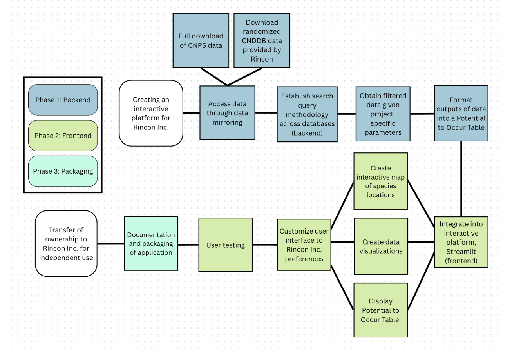

# Engineering a Data Processing Application for an Environmental Consulting Company

### The Overarching Problem

California’s diverse ecosystems are under increasing pressure from multiple environmental and human-inflicted challenges. Some of these challenges include urban development, habitat fragmentation, and accelerating climate change. Urban development is expanding into natural landscapes, Habitat fragmentation disrupts ecosystem connectivity, and accelerating climate change alters environmental conditions at an unprecedented rate. These pressures are affecting California's ecosystems and creating new challenges for biodiversity conservation and sustainable development.

These environmental challenges directly impact California's wildlife species and sensitive habitats. Driving shifts in species distributions and increase the vulnerability of already at-risk plants and wildlife. This makes it critical to better understand how development and environmental change affect ecological systems.

### About Rincon Consultants Inc. 

As a California-based environmental consulting firm, Rincon helps public and private sector projects navigate the balance between development and stewardship. Specifically, through Rincon’s Biological Resources Team, biologists conduct evaluations to assess potential impacts on species and habitats. These evaluations involve identifying species presence, occurrence patterns, and habitat locations within a project area.

### The Data Science Need

To conduct project evaluations, biologists access several different biological datasets and go through time-consuming and manual data processing. This includes downloading separate files from different websites, cross-validation, data cleaning (standardizing, merging, filtering, etc.), retrieving spatial information from a GIS team, and producing analysis tools. The workflow involves many different steps across multiple tools, datasets, and teams. It is manual and not consistent, meaning a biologist may approach the process differently depending on their own methods and experience. Therefore, the gap within Rincon’s biological evaluation process was the lack of a centralized system to streamline and standardize the work.

**Our goal** was to provide Rincon Consultants with a scalable and efficient system that allows biologists to spend less time managing data and more time focused on ecological interpretation and environmental decision-making.

To achieve this, we defined three deliverables:

1. Establish a reproducible data processing workflow that helps automate data integration while improving data retrieval consistency across projects.

2. Design an interactive, user-friendly application designed to simplify and standardize project data processing.

3. Maintain a detailed and packaged code repository that allows for future expansion and adaptation of the tool over time.

### The Approach

Our approach was broken down into three main parts: 1) backend development, 2) frontend development, 3) packaging.

This approach allowed us to perfect the replication of a reproducible and standardized data processing workflow that could be easily applied to projects of different scales and needs. Once the workflow was completed, we were able to integrate the workflow into a more user-friendly experience using the application builder Streamlit. This framework allowed for specific gadgets and customization needs, requested by Rincon, such as uploading files, mapping large-scale projects, creating editable tables, and exporting tables to a formatted Microsoft Word report document.

### The Bio Weaver Tool

<video class="scroll-video" src="1_boundary.mp4" muted loop playsinline></video>

Users are able to upload a project boundary in the form of a .GEOJSON file. The boundary can then be viewed through an interactive map, allowing the user to pan and zoom in on the boundary location. Users can then apply their desired search radius criteria and a buffer will be applied to the boundary. The user can again view the project area through an interactive map, displaying the original boundary and the search radius buffer to confirm the final area they would like to search for species.

<video class="scroll-video" src="2_mapchartsdata.mp4" muted loop playsinline></video>

After applying the buffer, users can jump to the results page. As the page loads, on the backend the tool searches for species records that occur within the project area, and populates their spatial locations onto the map shown on the results page. Users can pan around and zoom to see the proximity of different species to the project site. As users hover over each species on the map, the attributes for that species appear, such as scientific name and location details. This page also features a table of the count of each species that occurred within the search area. The species returned from each data source in the search is located within these raw data tables that can be exported as .csv files.
 

<video class="scroll-video" src="3_ptoreport.mp4" muted loop playsinline></video>

The next page features an editable report builder, which consolidates all species records into one table and provides a total count of the returned species at the top. Users can add columns and sort the table by them as desired, such as by taxon category. Edits can be made through a drop down menu and inputting text into columns. Once all desired edits have been made, the report table can be saved and the counts of assigned species updates at the top. The file can also be renamed as desired and finally exported as a Word document.

<video class="scroll-video" src="4_wordexport.mp4" muted loop playsinline></video>

The exported Word document contains the edits made in the dashboard. It is formatted in a precise way for direct use in final project reports.

*Note: For demonstration and security of classified information purposes, all data has been randomized and is not accurate.*

The Bio Weaver Tool serves as a single platform to retrieve, search, review, map, edit, and export project information. It dramatically simplifies Rincon's data processing workflow and creates consistent, reproducible results.

### Next Steps

This version of the Bio Weaver Tool provides Rincon with an initial fully functional tool that can be used every day in the workplace. However, this version is also foundational, and along with the application, Rincon also received much documentation/instructions to further build and expand the tool. One potential next step would be to incorporate additional biological data sources used in the tool. Another possibility is for them to extend map interactivity and details, such as the incorporation of various mapping features (elevation, soils, etc.). For the long term, Rincon could also integrate benchmark capabilities within the dashboard to allow for multi-project comparison over time.

Overall, our project goes beyond just a simple dashboard tool. It is clear that there is a growing need for environmental consulting workflows to become more scalable, more consistent, and more accessible, especially as biological data and projects become more complex. The Bio Weaver is just one example we have set of how we can use integrated data tools to move workflows in that direction. 

### My Experience

This project was exciting to take on, as application development was not a direct part of the coursework of the MEDS program. It was very rewarding to tackle challenges every day as a part of this project, from learning what an API was to how testing and debugging worked. One of the key things I gained as a part of this project was communication with a client and making decisions about design based upon the needs of a user. I also greatly improved my public speaking skills through faculty reviews and the final public presentation, where my team presented the final application to an audience of peers, faculty members, industry professionals. The best piece of this project was knowing that it would be used in the biologist's daily workflows, and continuously improved upon by their own data teams. This project has given me a interest in building additional tools for different applications, and the confidence to tackle challenging tasks with the knowledge that with teamwork, research, and a little bit of creativity anything can be accomplished. 

### Acknowledgements

We extend our gratitude to our team at Rincon Consults Inc., Lisa Achter, Carly Caswell, Robin Murray, Allie Sennett, Tyler Friesen, Dr. Kelly Caylor, Dr. Carmen Galaz García, the MEDS Capstone Committee, and our MEDS cohort for their support, feedback, and love throughout the year.
